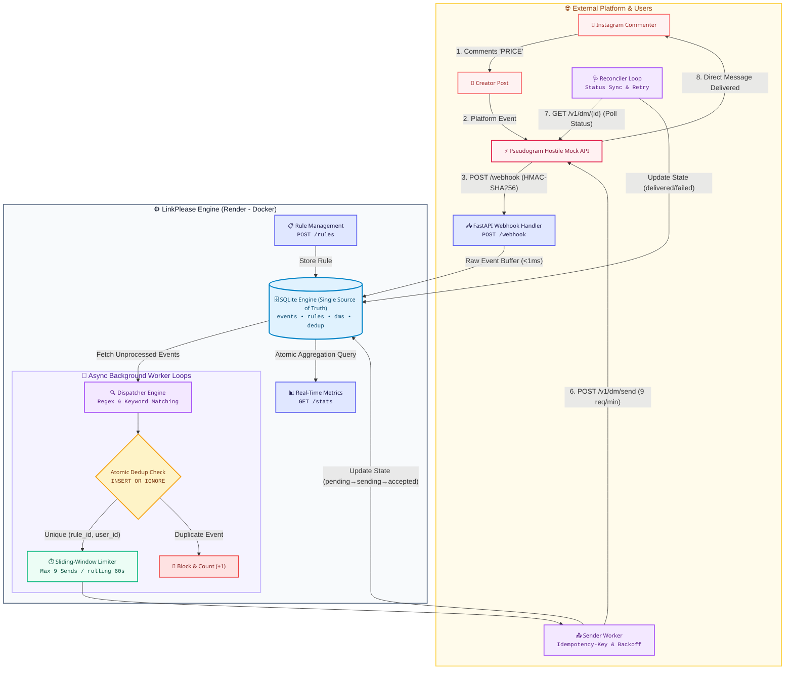

# 🚀 LinkPlease — Tech Intern Assignment

> A resilient, production-minded automation engine for Instagram creators built on top of the hostile [Pseudogram API](https://pseudogram-api.onrender.com).

---

## 📌 Submission Details

| Field | Details |
|---|---|
| **Candidate Name** | Harsh Kumar |
| **Email** | `harsh_kumar@srmap.edu.in` |
| **Deployed API Base URL** | [`https://linkplease-harsh.onrender.com`](https://linkplease-harsh.onrender.com) |
| **Demo & Walkthrough Video** | [Watch on Google Drive](https://drive.google.com/file/d/1Y_dAVjxp8iNauc3aMzO3IFHMwR38ZRCm/view?usp=sharing) |
| **Parts Completed** | **Part A + Part B + Part C** (100% Scope) |
| **Failure Analysis** | [`FAILURES.md`](./FAILURES.md) |

---

## 🎯 What It Does

| Part | Status | Description |
|---|:---:|---|
| **Part A — Core Engine** | ✅ | Dynamic rule creation (`POST /rules`), case-insensitive substring matching, atomic SQLite dedup per `(rule, user)`, and queue persistence ensuring zero silent message loss. |
| **Part B — Security & Stats** | ✅ | HMAC-SHA256 constant-time webhook signature verification (`X-PseudoGram-Signature`), rejecting forged requests with `401`. Real-time, atomic `/stats` endpoint. |
| **Part C — Reconciliation & Load** | ✅ | Background reconciliation loop (`GET /v1/dm/{id}`) to detect and retry accepted DMs that later failed. `comment.deleted` tombstoning. Sliding-window rate limiter (9 req/min). |

---

## 🏗️ Architecture & Design



### 1. Fast, Non-Blocking Ingestion (`app/main.py`)
- The `/webhook` handler verifies the HMAC signature and writes the raw event directly to SQLite.
- It returns `200 OK` in `< 1ms`, completely decoupling ingestion from processing and guaranteeing zero dropped webhooks under burst load.

### 2. Atomic Dispatcher (`app/matcher.py`)
- Polls unprocessed events and matches comment text against active rules.
- Atomically claims the `(rule_id, user_id)` pair using `INSERT OR IGNORE`.
- **Guarantee:** Two identical events arriving within the same millisecond can never produce duplicate DMs. The database enforces this, not application memory.

### 3. Rate-Limited Sender (`app/sender.py` & `app/rate_limiter.py`)
- Sends queued DMs under a **sliding-window rate limiter** capped at 9 requests per rolling 60 seconds (providing a safe margin below the 10/min API limit).
- Atomically transitions status (`pending → sending`) before dispatching HTTP calls.
- Attaches an `Idempotency-Key` to every outbound send, preventing duplicate DMs even when retrying after network timeouts.

### 4. Background Reconciler (`app/reconciler.py`)
- The Pseudogram API returns `202 Accepted` on send, but ~15% of accepted DMs fail asynchronously.
- The reconciler polls `GET /v1/dm/{dm_id}`:
  - `delivered` → Marks status as delivered (increments `sent` in `/stats`).
  - `failed` → Re-queues the DM with a fresh idempotency key up to `MAX_ATTEMPTS`.
  - `queued` → Waits for the platform to process.

---

## 📡 API Contract

### `POST /webhook`
Receives comment events from Pseudogram. Validates `X-PseudoGram-Signature` (`sha256=<hex>`).
```bash
# Valid Signature -> 200 OK
# Forged Signature -> 401 Unauthorized
```

### `POST /rules`
Creates a matching rule for automatic DM triggers.
```json
// Request
{
  "keyword": "PRICE",
  "dm_message": "Here is the price list: https://example.com/pricing"
}

// Response (201 Created)
{
  "rule_id": "f485b75de2e64986890edc922133f39b",
  "keyword": "PRICE",
  "dm_message": "Here is the price list: https://example.com/pricing"
}
```

### `GET /stats`
Returns live system metrics computed in a single atomic transaction.
```json
{
  "sent": 142,
  "failed": 3,
  "queued": 8,
  "duplicates_blocked": 57
}
```
- **`sent`**: Confirmed delivered by the platform.
- **`failed`**: Terminal failures after exhausting all retry backoffs.
- **`queued`**: In-flight, pending dispatch, or awaiting reconciliation.
- **`duplicates_blocked`**: Redundant events blocked by dedup constraints.

---

## 🧪 Local Setup & Verification

### 1. Installation
```bash
# Create virtual environment
python3 -m venv .venv && source .venv/bin/activate

# Install dependencies
pip install -r requirements.txt
```

### 2. Environment Variables
```bash
export PSEUDOGRAM_API_KEY="your_api_key_here"
export PSEUDOGRAM_BASE_URL="https://pseudogram-api.onrender.com"
export DATABASE_PATH="linkplease.db"
```

### 3. Run Automated Test Suites
```bash
# Correctness Suite: rules, dedup, redeliveries, 401 signature rejection
python3 scripts/smoke_test.py

# High-Concurrency Load Suite: 520 events, rate-limit invariants
python3 scripts/load_test.py
```

### 4. Run Server Locally
```bash
uvicorn app.main:app --host 0.0.0.0 --port 8000 --workers 1
```

---

## 🔍 Failure Modes & Tradeoffs

For a complete, transparent analysis of all known edge cases, race conditions, and architectural boundaries (including single-worker process locking, ephemeral disk constraints, and clock-skew buffering), see [`FAILURES.md`](./FAILURES.md).


